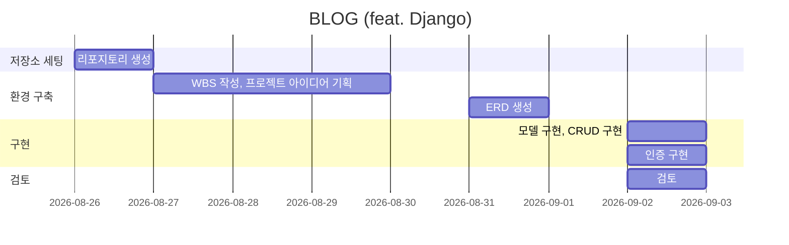
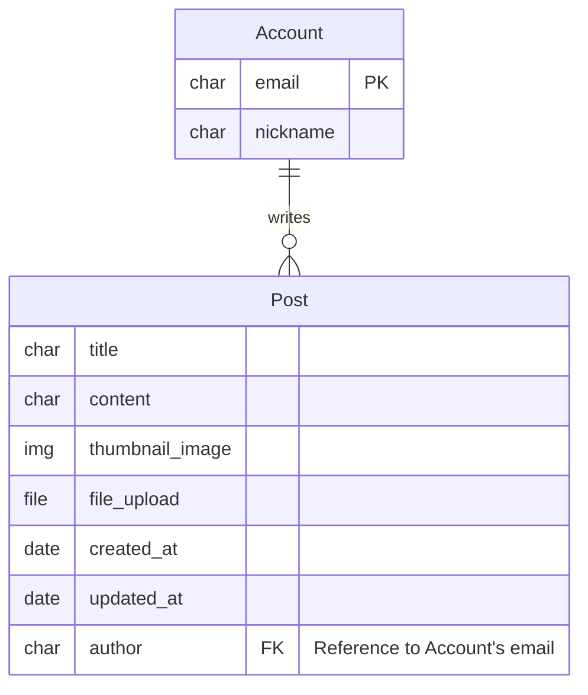

# SUMMARY

장고 프레임워크 기반의 블로그 개발

# WBS

# URL

| 역할        | URL                        | 앱       |
| :---------- | :------------------------- | :------- |
| 메인        | /                          | main     |
| 로그인      | /accounts/login            | accounts |
| 로그아웃    | /accounts/logout           | accounts |
| 게시글 목록 | /blog                      | blog     |
| 게시글 상세 | /blog/<int:post_pk>        | blog     |
| 게시글 작성 | /blog/write                | blog     |
| 게시글 수정 | /blog/edit/<int:post_pk>   | blog     |
| 게시글 삭제 | /blog/delete/<int:post_pk> | blog     |
| 게시글 검색 | /blog?q='검색어'           | blog     |

# DB

# DEMO

시연 영상

# ISSUE

- mermaid 를 VS CODE에서 미리 보기 하려면?

  Markdown Preview Mermaid Support 확장 프로그램 설치
