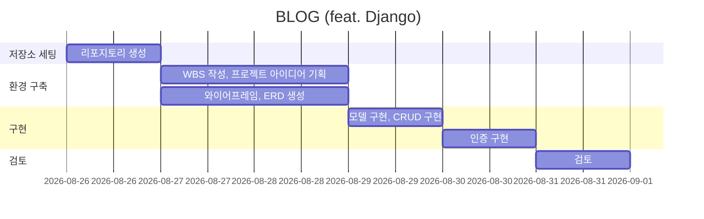

# SUMMARY
장고 프레임워크 기반의 블로그 개발

# WBS

```mermaid

gantt
    title BLOG (feat. Django)
    dateFormat  MM-DD
    section 저장소 세팅
    리포지토리 생성     :a1, 08-26, 1d
    section 환경 구축
    WBS 작성, 프로젝트 아이디어 기획 :a2, 08-27, 2d
    와이어프레임, ERD 생성 :a3, 08-27, 2d
    section 구현
    모델 구현, CRUD 구현 :a4, 08-29, 1d
    인증 구현           :a5, 08-30, 1d
    section 검토
    검토               :a6, 08-31, 1d
```

# WIRE FRAME
화면 기획

# ISSUE
- mermaid 를 VS CODE에서 미리 보기 하려면?

    Markdown Preview Mermaid Support 확장 프로그램 설치
